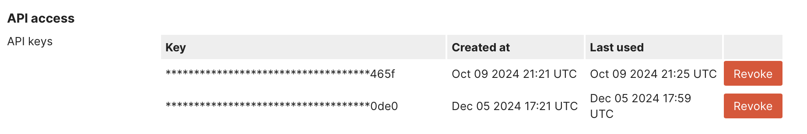
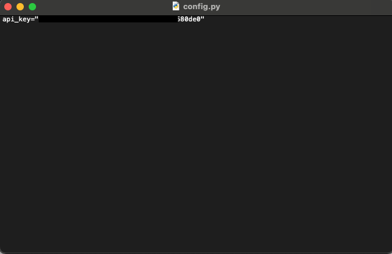

# Grab Meraki IDs

You can run this python script to grab your Meraki Dashboard Org and Network IDs

# Grab your API Key

From your Meraki Dashboard, go to your profile and copy your API key

# Save API Key 

Save the API key in the `config.py` file

# Run the script

`% python3 meraki_id.py`

The script will output your Meraki Org ID number(s)

Enter the Org ID number and the network IDs for that org will output